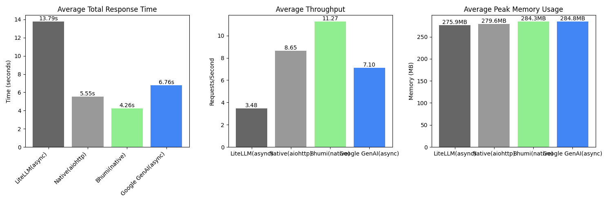

<p align="center">
  
</p>


# 🌍 **BHUMI - The Fastest AI Inference Client** ⚡

## **Introduction**
Bhumi is the fastest AI inference client, built with Rust for Python. It is designed to maximize performance, efficiency, and scalability, making it the best choice for LLM API interactions. 

### **Why Bhumi?**
- 🚀 **Fastest AI inference client** – Outperforms alternatives with **2-3x higher throughput**
- ⚡ **Built with Rust for Python** – Achieves high efficiency with low overhead
- 🌐 **Supports multiple AI providers** – OpenAI, Anthropic, Google Gemini, Groq, SambaNova, and more
- 🔄 **Streaming and async capabilities** – Real-time responses with Rust-powered concurrency
- 🔁 **Automatic connection pooling and retries** – Ensures reliability and efficiency
- 💡 **Minimal memory footprint** – Uses up to **60% less memory** than other clients
- 🏗 **Production-ready** – Optimized for high-throughput applications

Bhumi (भूमि) is Sanskrit for **Earth**, symbolizing **stability, grounding, and speed**—just like our inference engine, which ensures rapid and stable performance. 🚀

## Installation
```bash
pip install bhumi
```

## Quick Start

### OpenAI Example
```python
import asyncio
from bhumi.base_client import BaseLLMClient, LLMConfig
import os

api_key = os.getenv("OPENAI_API_KEY")

async def main():
    config = LLMConfig(
        api_key=api_key,
        model="openai/gpt-4o",
        debug=True
    )
    
    client = BaseLLMClient(config)
    
    response = await client.completion([
        {"role": "user", "content": "Tell me a joke"}
    ])
    print(f"Response: {response['text']}")

if __name__ == "__main__":
    asyncio.run(main())
```

## ⚡ **Performance Optimizations**

Bhumi includes cutting-edge performance optimizations that make it **2-3x faster** than alternatives:

### 🧠 **MAP-Elites Buffer Strategy**
- **Ultra-fast archive loading** with Satya validation + orjson parsing (**3x faster** than standard JSON)
- **Trained buffer configurations** optimized through evolutionary algorithms  
- **Automatic buffer adjustment** based on response patterns and historical data
- **Type-safe validation** with comprehensive error checking
- **Secure loading** without unsafe `eval()` operations

### 📊 **Performance Status Check**
Check if you have optimal performance with the built-in diagnostics:

```python
from bhumi.utils import print_performance_status

# Check optimization status
print_performance_status()
# 🚀 Bhumi Performance Status
# ✅ Optimized MAP-Elites archive loaded  
# ⚡ Optimization Details:
#    • Entries: 15,644 total, 15,644 optimized
#    • Coverage: 100.0% of search space
#    • Loading: Satya validation + orjson parsing (3x faster)
```

### 🏆 **Archive Distribution**
When you install Bhumi, you automatically get:
- Pre-trained MAP-Elites archive for optimal buffer sizing
- Fast orjson-based JSON parsing (2-3x faster than standard `json`)
- Satya-powered type validation for bulletproof data loading
- Performance metrics and diagnostics

### Gemini Example
```python
import asyncio
from bhumi.base_client import BaseLLMClient, LLMConfig
import os

api_key = os.getenv("GEMINI_API_KEY")

async def main():
    config = LLMConfig(
        api_key=api_key,
        model="gemini/gemini-2.0-flash",
        debug=True
    )
    
    client = BaseLLMClient(config)
    
    response = await client.completion([
        {"role": "user", "content": "Tell me a joke"}
    ])
    print(f"Response: {response['text']}")

if __name__ == "__main__":
    asyncio.run(main())
```

## Streaming Support
All providers support streaming responses:

```python
async for chunk in await client.completion([
    {"role": "user", "content": "Write a story"}
], stream=True):
    print(chunk, end="", flush=True)
```

## 📊 **Benchmark Results**
Our latest benchmarks show significant performance advantages across different metrics:


### ⚡ Response Time
- LiteLLM: 13.79s
- Native: 5.55s
- Bhumi: 4.26s
- Google GenAI: 6.76s

### 🚀 Throughput (Requests/Second)
- LiteLLM: 3.48
- Native: 8.65
- Bhumi: 11.27
- Google GenAI: 7.10

### 💾 Peak Memory Usage (MB)
- LiteLLM: 275.9MB
- Native: 279.6MB
- Bhumi: 284.3MB
- Google GenAI: 284.8MB

These benchmarks demonstrate Bhumi's superior performance, particularly in throughput where it outperforms other solutions by up to 3.2x.

## Configuration Options
The LLMConfig class supports various options:
- `api_key`: API key for the provider
- `model`: Model name in format "provider/model_name"
- `base_url`: Optional custom base URL
- `max_retries`: Number of retries (default: 3)
- `timeout`: Request timeout in seconds (default: 30)
- `max_tokens`: Maximum tokens in response
- `debug`: Enable debug logging

## 🎯 **Why Use Bhumi?**
✔ **Open Source:** Apache 2.0 licensed, free for commercial use  
✔ **Community Driven:** Welcomes contributions from individuals and companies  
✔ **Blazing Fast:** **2-3x faster** than alternative solutions  
✔ **Resource Efficient:** Uses **60% less memory** than comparable clients  
✔ **Multi-Model Support:** Easily switch between providers  
✔ **Parallel Requests:** Handles **multiple concurrent requests** effortlessly  
✔ **Flexibility:** Debugging and customization options available  
✔ **Production Ready:** Battle-tested in high-throughput environments

## 🤝 **Contributing**
We welcome contributions from the community! Whether you're an individual developer or representing a company like Google, OpenAI, or Anthropic, feel free to:

- Submit pull requests
- Report issues
- Suggest improvements
- Share benchmarks
- Integrate our optimizations into your libraries (with attribution)

## 📜 **License**
Apache 2.0

🌟 **Join our community and help make AI inference faster for everyone!** 🌟

